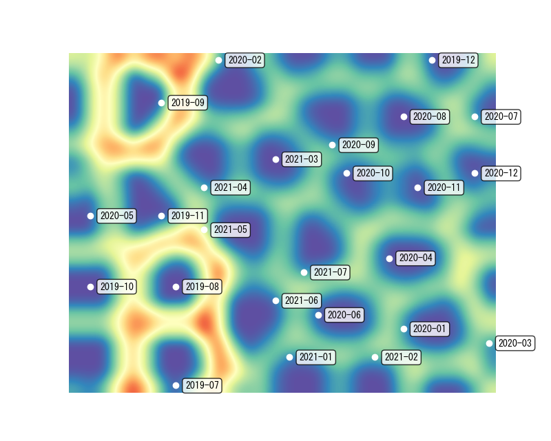

# make_som
 somocluを使用して自己組織化マップを生成する
# 動作環境
- Windows10
- Python3.8以上(Python3.7でsomocluのインストールに失敗します)

# 自己組織化マップの作成
1. 以下のコマンドを実行する
```Bash
pip3 install -r requirements.txt
```
実行できない場合は以下のコマンドを実行する.
```Bash
pip3 install numpy
pip3 install somoclu==1.7.4
```
2. `config.yaml`を編集する
3. 以下のコマンドを実行する
```
python3 make_som.py
```
4. 実行後, 以下のような画像が表示・ファイル出力されたら成功です.  


# 出力される自己組織化マップの見かた
出力される自己組織化マップでは青色に近ければ近いほどその場所は距離が近く, 赤色に近ければ近いほどその場所は距離が遠いです.赤色に近い場所は標高が高く, 山がそびえ立っているイメージです.